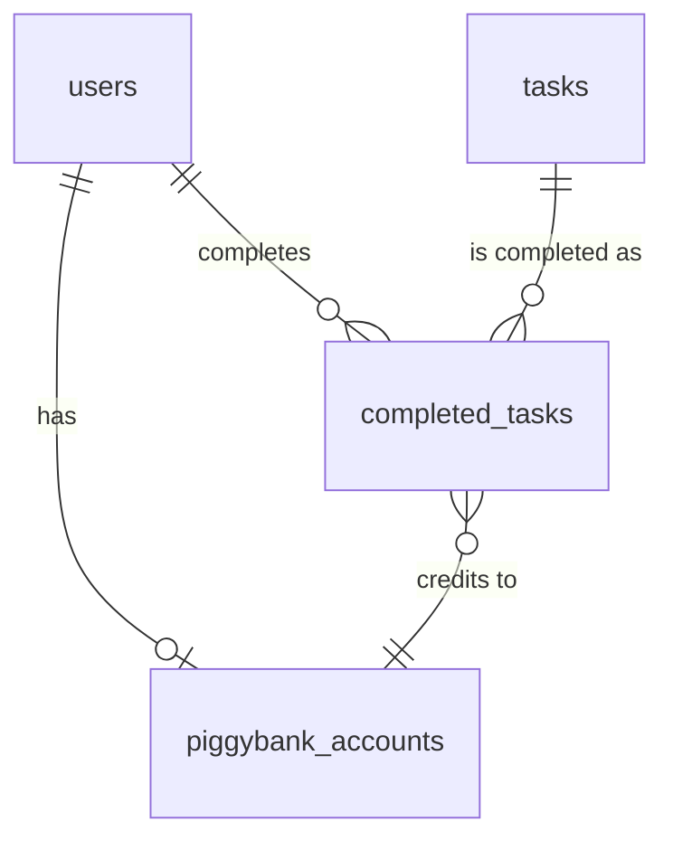

# Database Schema Documentation

This document describes the database structure of the Taschengeld application.

## Overview

The database uses PostgreSQL and consists of several interconnected tables that manage users, tasks, completed tasks, and payments.

## Tables

### users

Primary table for all user accounts (both parents and children).

```sql
CREATE TABLE users (
    user_id             SERIAL PRIMARY KEY,
    name               VARCHAR(100) NOT NULL,
    icon               VARCHAR(50),
    birthday           DATE,
    piggybank_account_id INTEGER REFERENCES piggybank_accounts(account_id),
    created_at         TIMESTAMP WITH TIME ZONE DEFAULT CURRENT_TIMESTAMP,
    sound_url          VARCHAR(255)
);
```

**Indexes:**

- `PRIMARY KEY` on `user_id`
- Foreign key index on `piggybank_account_id`

### tasks

Defines available tasks that can be assigned and completed.

```sql
CREATE TABLE tasks (
    task_id            SERIAL PRIMARY KEY,
    title             VARCHAR(100) NOT NULL,
    description       TEXT,
    icon_name         VARCHAR(50),
    sound_url         VARCHAR(255),
    payout_value      DECIMAL(10,2) NOT NULL,
    is_active         BOOLEAN DEFAULT true,
    created_at        TIMESTAMP WITH TIME ZONE DEFAULT CURRENT_TIMESTAMP,
    updated_at        TIMESTAMP WITH TIME ZONE DEFAULT CURRENT_TIMESTAMP
);
```

**Indexes:**

- `PRIMARY KEY` on `task_id`
- Index on `is_active`

### completed_tasks

Records task completions by users.

```sql
CREATE TABLE completed_tasks (
    c_task_id          SERIAL PRIMARY KEY,
    user_id           INTEGER REFERENCES users(user_id),
    task_id           INTEGER REFERENCES tasks(task_id),
    description       TEXT,
    payout_value      DECIMAL(10,2) NOT NULL,
    created_at        TIMESTAMP WITH TIME ZONE DEFAULT CURRENT_TIMESTAMP,
    comment           TEXT,
    attachment        VARCHAR(255),
    payment_status    VARCHAR(20) DEFAULT 'Unpaid',
    piggybank_account_id INTEGER REFERENCES piggybank_accounts(account_id)
);
```

**Indexes:**

- `PRIMARY KEY` on `c_task_id`
- Foreign key indexes on `user_id`, `task_id`, `piggybank_account_id`
- Index on `payment_status`

### piggybank_accounts

Manages user payment accounts.

```sql
CREATE TABLE piggybank_accounts (
    account_id         SERIAL PRIMARY KEY,
    user_id           INTEGER UNIQUE REFERENCES users(user_id),
    account_number    VARCHAR(50) UNIQUE NOT NULL,
    balance           DECIMAL(10,2) DEFAULT 0.00,
    created_at        TIMESTAMP WITH TIME ZONE DEFAULT CURRENT_TIMESTAMP
);
```

**Indexes:**

- `PRIMARY KEY` on `account_id`
- `UNIQUE` on `user_id`
- `UNIQUE` on `account_number`

## Relationships



### Key Relationships:

1. User → Completed Tasks (1:Many)
2. Task → Completed Tasks (1:Many)
3. User → Piggybank Account (1:1)
4. Completed Task → Piggybank Account (Many:1)

## Data Types

### Common Fields

- **IDs**: `SERIAL` (auto-incrementing integer)
- **Names/Titles**: `VARCHAR(100)`
- **Descriptions**: `TEXT`
- **Timestamps**: `TIMESTAMP WITH TIME ZONE`
- **Money**: `DECIMAL(10,2)`
- **Status Flags**: `BOOLEAN`

### Enums and Constants

- Payment Status: `'Paid'`, `'Unpaid'`
- Active Status: `true`, `false`

## Constraints

### Foreign Keys

```sql
ALTER TABLE users
    ADD CONSTRAINT fk_user_piggybank
    FOREIGN KEY (piggybank_account_id)
    REFERENCES piggybank_accounts(account_id);

ALTER TABLE completed_tasks
    ADD CONSTRAINT fk_completed_task_user
    FOREIGN KEY (user_id)
    REFERENCES users(user_id);

ALTER TABLE completed_tasks
    ADD CONSTRAINT fk_completed_task_task
    FOREIGN KEY (task_id)
    REFERENCES tasks(task_id);
```

### Check Constraints

```sql
ALTER TABLE piggybank_accounts
    ADD CONSTRAINT check_balance_non_negative
    CHECK (balance >= 0);

ALTER TABLE tasks
    ADD CONSTRAINT check_payout_positive
    CHECK (payout_value > 0);
```

## Migrations

Migration files are stored in `/migrations` directory. Each migration includes:

- Up migration (changes to apply)
- Down migration (how to reverse changes)

Example:

```sql
-- Up Migration
CREATE TABLE users (/*...*/);

-- Down Migration
DROP TABLE users;
```

## Backup and Recovery

See [Backup and Restore Guide](../5-maintenance/backup-restore.md) for:

- Backup procedures
- Recovery procedures
- Backup schedule
- Data retention policy

## Performance Considerations

1. **Indexes**

   - Primary keys
   - Foreign keys
   - Frequently queried fields

2. **Partitioning**

   - Consider partitioning `completed_tasks` by date for large datasets

3. **Archiving**
   - Archive old completed tasks
   - Maintain summary data

## Security

1. **Access Control**

   - Row-level security
   - User permissions
   - Audit logging

2. **Data Protection**
   - Encrypted connections
   - Secure backups
   - Data sanitization

## Maintenance

Regular maintenance tasks:

1. Update statistics
2. Reindex tables
3. Vacuum analyze
4. Check for bloat

See [Monitoring Guide](../5-maintenance/monitoring.md) for details.

Last Updated: December 4, 2024
