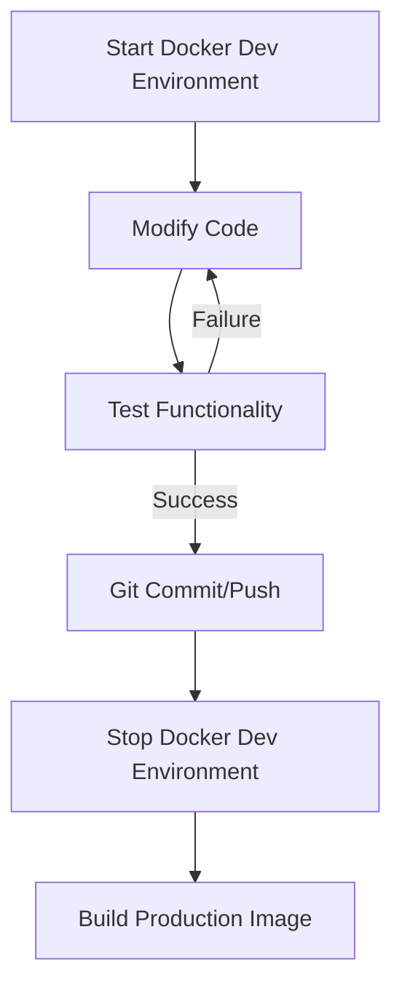
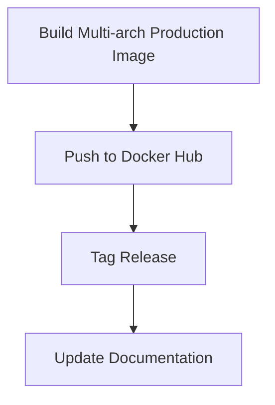
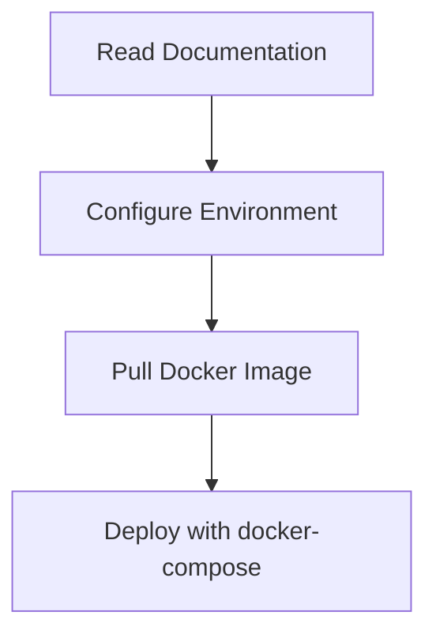

# Docker Development Principles and Workflow

## Overview

This document outlines the core principles and workflow for developing and deploying the Taschengeld application using Docker. It's designed to ensure consistent behavior between development and production environments while maintaining efficient development practices.

## Core Principle

**"If it works in Development, it must work identically in Production"**

This principle guides all our development and deployment decisions. While development and production environments may use different techniques to achieve functionality, the end result must be identical.

## Environment Separation

### Development Environment
- **Platform**: MacBook M1 (ARM64)
- **Purpose**: Active development and testing
- **Configuration**: Uses `docker-compose.dev.yml`
- **Features**:
  - Hot reloading
  - Volume mounting for live code updates
  - Development tools and debugging capabilities
  - Local database access
  - Never runs production containers

### Production Environment
- **Platform**: Any platform running Docker (AMD64 or ARM64)
- **Purpose**: End-user deployment
- **Configuration**: Uses `docker-compose.yml`
- **Features**:
  - Pulls pre-built images from Docker Hub
  - Multi-architecture support (AMD64 and ARM64)
  - No development tools or source code access
  - Production-optimized builds
  - Never runs development containers

## Development to Production Workflow

### 1. Development Phase

### 2. Production Build Phase

### 3. End User Deployment

## Database Strategy

PostgreSQL is our chosen database solution because it:
- Maintains perfect Dev-to-Prod parity
- Works identically across all architectures
- Has excellent Docker integration
- Provides reliable data persistence through Docker volumes
- Offers optimal support for our Prisma ORM

## Critical Implementation Points

### 1. Development Environment
- Uses Docker volumes for:
  - Source code (`./:/app`)
  - Node modules (`/app/node_modules`)
  - Next.js build (`/app/.next`)
- Runs in development mode with hot reloading
- Database runs in local container
- Environment variables configured for development

### 2. Production Build Process
- Multi-stage build process
- Builds for both ARM64 and AMD64 architectures
- Removes development dependencies
- Optimizes for production performance
- Includes only production-necessary files

### 3. Production Deployment
- Pulls pre-built images from Docker Hub
- Uses production-specific environment variables
- Runs optimized code without development tools
- Database persistence through Docker volumes

## Build Process Requirements

The build process must:
1. Reliably convert development code to production format
2. Handle all architecture-specific requirements
3. Maintain functionality across environments
4. Be fully automated and repeatable
5. Include comprehensive testing

## Architecture Compatibility

### Current Stack Compatibility

1. **Core Components**
   - Node.js (node:18-alpine) ✅ Multi-arch support
   - PostgreSQL (postgres:16-alpine) ✅ Multi-arch support
   - Next.js ✅ Platform agnostic
   - Prisma ✅ Configured for multi-arch

2. **System Dependencies**
   - postgresql-client ✅ Available on all platforms
   - python3 ✅ Available on all platforms
   - make ✅ Available on all platforms
   - g++ ✅ Available on all platforms

3. **Native Dependencies**
   - Sharp (image processing) ⚠️ Requires careful handling
   - Prisma Client ⚠️ Requires specific binary targets

### Risk Areas

1. **Native Node Modules**
   - Risk: Modules with architecture-specific binaries
   - Impact: Build failures on different architectures
   - Mitigation: Test builds on both architectures before committing

2. **Build Tools**
   - Risk: Tools that only work on specific architectures
   - Impact: Development-to-production inconsistency
   - Mitigation: Verify multi-arch support before adding tools

3. **Performance Variations**
   - Risk: Different performance characteristics between architectures
   - Impact: Timing-sensitive features may behave differently
   - Mitigation: Test time-sensitive operations on both architectures

### Safeguards

1. **Development Workflow**
   - Always test new dependencies in Docker immediately
   - Verify builds on both architectures before pushing
   - Use architecture-specific tags for testing

2. **Dependency Management**
   - Prefer pure JavaScript/TypeScript packages
   - Document any architecture-specific requirements
   - Keep native dependencies to a minimum

3. **Testing Strategy**
   - Test on both architectures before release
   - Maintain test environments for both architectures
   - Include architecture-specific test cases

## Common Pitfalls to Avoid

1. **Development-only Dependencies**
   - ❌ Using tools that won't work in production
   - ✅ Ensure all runtime dependencies are properly included in production builds

2. **Architecture-specific Code**
   - ❌ Writing code that only works on ARM64
   - ✅ Ensuring code and dependencies work on both ARM64 and AMD64

3. **Environment Assumptions**
   - ❌ Assuming development-specific paths or configurations
   - ✅ Using environment variables and proper configuration management

4. **Build Process Reliability**
   - ❌ Manual steps in the build process
   - ✅ Automated, documented, and tested build procedures

## Testing Requirements

1. Development Testing
   - Test all features in development environment
   - Verify database operations
   - Check all API endpoints
   - Validate environment variable handling

2. Production Build Testing
   - Build production image locally
   - Test production image before pushing
   - Verify multi-architecture support
   - Validate all features work as in development

## Documentation Requirements

1. Maintain clear documentation for:
   - Development setup process
   - Build and deployment procedures
   - Environment variable configuration
   - Common troubleshooting steps

2. Keep documentation updated with:
   - Any workflow changes
   - New development requirements
   - Production deployment updates

## Version Control Practices

1. Development
   - Regular commits during development
   - Clear commit messages
   - Feature branches for new development

2. Production
   - Tagged releases for production builds
   - Updated documentation with each release
   - Clear changelog maintenance

## Conclusion

This Docker-first development approach ensures that our application behaves consistently across all environments while maintaining an efficient development workflow. By following these principles and practices, we maintain reliability and predictability in our development-to-production pipeline. 